# 📚 SkillLens: Transform PR Feedback into Developer Growth

[](https://github.com/hyperskill/skilllens-action/actions/workflows/ci.yml)
[](https://github.com/hyperskill/skilllens-action/actions/workflows/check-dist.yml)
[](https://github.com/hyperskill/skilllens-action/actions/workflows/codeql-analysis.yml)
[](./badges/coverage.svg)
[](LICENSE)

[](https://github.com/marketplace/actions/skilllens-pr-review-learning-developer-growth)
[](https://hyperskill.org)
[](#-privacy--security)
[](#-quick-start)

> **Turn every code review into a learning opportunity.** SkillLens
> automatically analyzes PR review feedback and suggests relevant learning
> resources from Hyperskill — no configuration, no API keys, just actionable
> education when you need it most.

```mermaid
graph LR
    A[PR Review<br/>Comments] -->|Analyze| B[SkillLens]
    B -->|AI-Powered<br/>Topic Extraction| C[Learning Topics]
    C -->|Match with<br/>Hyperskill| D[Curated<br/>Resources]
    D -->|Post as<br/>Comment| E[📚 Learning<br/>Recommendations]

    style B fill:#7B68EE,stroke:#5a4abf,stroke-width:3px,color:#fff
    style E fill:#90EE90,stroke:#228B22,stroke-width:2px
```



## ✨ Why SkillLens?

- ✅ **Zero Configuration** — Works out of the box with your existing GitHub
  workflow
- 🔒 **Privacy-First** — Only reads review comments, never your source code
- 🎯 **AI-Powered Intelligence** — Contextual understanding, not keyword
  matching
- 📚 **Curated Learning Paths** — Direct links to relevant Hyperskill courses
  and topics
- 🤖 **Non-Intrusive** — Single, auto-updating comment per PR (no notification
  spam)
- ⚡ **Lightning Fast** — Typical execution under 10 seconds

Perfect for teams building a **culture of continuous learning**, open-source
projects supporting **contributor growth**, and developers seeking
**personalized skill development**.

## 🚀 Quick Start

Add this workflow to `.github/workflows/skilllens.yml` in your repository:

<!-- prettier-ignore-start -->
<!-- markdownlint-disable MD013 -->
```yaml
name: SkillLens Learning Recommendations

on:
  pull_request_review:
    types: [submitted, edited]
  issue_comment:
    types: [created, edited]

permissions:
  pull-requests: write
  id-token: write

concurrency:
  group:
    skilllens-${{ github.event.pull_request.number || github.event.issue.number }}
  cancel-in-progress: false

jobs:
  skilllens:
    if:
      ${{ github.event_name != 'issue_comment' || github.event.issue.pull_request }}
    runs-on: ubuntu-latest
    steps:
      - uses: hyperskill/skilllens-action@v1
        env:
          GITHUB_TOKEN: ${{ secrets.GITHUB_TOKEN }}
```
<!-- markdownlint-enable MD013 -->
<!-- prettier-ignore-end -->

**That's it!** 🎉 The action will now automatically post learning
recommendations when reviewers provide feedback.

## 📖 How It Works

1. **Monitors** PR reviews, inline comments, and conversation threads
1. **Filters** noise (LGTM, emojis) to focus on substantive feedback
1. **Analyzes** comments using AI to identify learning opportunities
1. **Matches** topics with Hyperskill's comprehensive course catalog
1. **Posts** a single, updateable comment with personalized recommendations

<details>
<summary><b>See an Example Output</b></summary>

When a reviewer comments:

> "Consider using list comprehension instead of a for loop here"

SkillLens posts:

---

<!-- SkillLens:v0 -->

### 📚 Learning Recommendations from Hyperskill

Based on recent review feedback, here are personalized learning resources:

**1. Python Collections & List Comprehensions** _(Confidence: 92%)_ Learn
efficient list operations and Pythonic patterns
[📖 View Course →](https://hyperskill.org/topics/list-comprehensions) ·
[🎯 Practice Problems →](https://hyperskill.org/practice)

**2. Code Optimization Techniques** _(Confidence: 87%)_ Master performance
optimization in Python applications
[📖 View Course →](https://hyperskill.org/topics/optimization) ·
[📚 Learning Track →](https://hyperskill.org/tracks/python-core)

---

<sub>🤖 Generated from review comments only • No source code analyzed •
[Learn more](https://github.com/hyperskill/skilllens-action)</sub>

</details>

## ⚙️ Configuration

### Inputs

| Input                 | Description                                        | Required | Default         | Example              |
| --------------------- | -------------------------------------------------- | -------- | --------------- | -------------------- |
| `oidc-audience`       | OIDC audience for backend authentication           | No       | `skilllens.dev` | `custom.domain.com`  |
| `default-language`    | Fallback language when repository language unknown | No       | `Python`        | `JavaScript`, `Java` |
| `max-topics`          | Maximum learning topics to include                 | No       | `5`             | `3`, `10`            |
| `min-confidence`      | Minimum confidence threshold (0-1)                 | No       | `0.65`          | `0.5`, `0.8`         |
| `fail-on-proxy-error` | Fail workflow on backend errors                    | No       | `false`         | `true`               |

### Outputs

| Output        | Description                              | Example Use                |
| ------------- | ---------------------------------------- | -------------------------- |
| `topics-json` | JSON array of identified learning topics | Store for metrics/analysis |
| `comment-url` | URL of the created/updated PR comment    | Send notifications         |

<details>
<summary><b>📝 Advanced Configuration Examples</b></summary>

### Language-Specific Configuration

```yaml
# Python Projects
- uses: hyperskill/skilllens-action@v1
  env:
    GITHUB_TOKEN: ${{ secrets.GITHUB_TOKEN }}
  with:
    default-language: Python
    max-topics: 5

# JavaScript/TypeScript Projects
- uses: hyperskill/skilllens-action@v1
  env:
    GITHUB_TOKEN: ${{ secrets.GITHUB_TOKEN }}
  with:
    default-language: JavaScript
    min-confidence: 0.7

# Java Projects
- uses: hyperskill/skilllens-action@v1
  env:
    GITHUB_TOKEN: ${{ secrets.GITHUB_TOKEN }}
  with:
    default-language: Java
    fail-on-proxy-error: true
```

### Using Outputs

```yaml
- name: Generate Recommendations
  id: skilllens
  uses: hyperskill/skilllens-action@v1
  env:
    GITHUB_TOKEN: ${{ secrets.GITHUB_TOKEN }}

- name: Save Topics
  run: echo "${{ steps.skilllens.outputs.topics-json }}" > topics.json

- name: Notify Slack
  if: steps.skilllens.outputs.comment-url
  run: |
    curl -X POST ${{ secrets.SLACK_WEBHOOK }} \
      -d "text=New learning recommendations: \
      ${{ steps.skilllens.outputs.comment-url }}"
```

</details>

## 🔒 Privacy & Security

> **Your code stays yours.** SkillLens is built on privacy-first principles.

### What We Access

✅ PR review comments and feedback ✅ Repository metadata (name, PR number) ✅
Public PR conversation threads

### What We DON'T Access

❌ Your source code ❌ File contents ❌ Private repository data ❌ Secrets or
credentials

### Authentication

- Uses GitHub's secure OIDC tokens (no API keys required)
- Tokens are short-lived and scoped to the workflow
- Backend verification ensures only legitimate GitHub Actions can call our API

### Required Permissions

| Permission      | Level | Purpose                                            |
| --------------- | ----- | -------------------------------------------------- |
| `pull-requests` | write | Read PR review comments and create/update comments |
| `id-token`      | write | Request OIDC authentication token                  |

> **Note:** The `pull-requests: write` permission typically covers both reading
> PR data and writing comments. If you encounter permission issues, see the
> [troubleshooting section](#-troubleshooting) for alternative configurations.

## 🎯 Use Cases

### For Development Teams

Build a **culture of continuous learning** by automatically connecting code
review feedback to educational resources. Perfect for onboarding, skill
development, and knowledge sharing.

### For Open Source Projects

Support **contributor growth** by providing learning resources alongside review
feedback. Reduce back-and-forth by helping contributors understand the "why"
behind suggestions.

### For Individual Developers

Turn every PR into a **personalized learning opportunity**. Never wonder where
to learn a concept mentioned in reviews — get instant, relevant recommendations.

### For Engineering Managers

Track **skill development trends** across your team. Identify common learning
needs and inform training priorities based on actual code review patterns.

## 🤝 Comparison with Alternatives

| Feature              | Manual Learning Search | AI Code Reviewers | SkillLens      |
| -------------------- | ---------------------- | ----------------- | -------------- |
| **Automated**        | No (Manual effort)     | Yes               | Yes            |
| **Learning-Focused** | If you remember        | No (Code only)    | Yes (Primary)  |
| **Privacy**          | Yes (No tool needed)   | No (Reads code)   | Yes (Reviews)  |
| **Setup Complexity** | N/A                    | API keys required | Zero config    |
| **Cost**             | Time-consuming         | Usually paid      | Free           |
| **Noise Level**      | N/A                    | Multiple comments | Single comment |

## ❓ Frequently Asked Questions

<details>
<summary><b>Does SkillLens read my source code?</b></summary>

No. SkillLens only analyzes PR review comments and feedback. It never accesses
your repository's source code, ensuring complete privacy and security.

</details>

<details>
<summary><b>What programming languages are supported?</b></summary>

SkillLens supports all languages available on Hyperskill, including:

- Python, Java, JavaScript, TypeScript
- Kotlin, Go, Scala, C++
- SQL, Bash, and more

The `default-language` input helps optimize recommendations when the repository
language cannot be automatically detected.

</details>

<details>
<summary><b>Can I use this with private repositories?</b></summary>

Yes! SkillLens works with both public and private repositories. It uses GitHub's
built-in authentication and only accesses review comments, which are already
visible to workflow runs.

</details>

<details>
<summary><b>How accurate are the recommendations?</b></summary>

SkillLens uses advanced AI to understand context and nuance in review comments.
The default confidence threshold of 0.65 ensures only relevant recommendations
are shown. You can adjust this with the `min-confidence` input.

</details>

<details>
<summary><b>Will this spam my PRs with comments?</b></summary>

No. SkillLens maintains a single comment per PR that updates in place. It uses a
hidden HTML marker to identify and update the same comment, preventing
notification spam.

</details>

<details>
<summary><b>What if the SkillLens API is down?</b></summary>

By default, the action logs a warning but doesn't fail your workflow. You can
change this behavior by setting `fail-on-proxy-error: true`.

</details>

## 🚨 Troubleshooting

<details>
<summary><b>Common Issues and Solutions</b></summary>

### "Resource not accessible by integration"

**Error message:**

```text
Error: Resource not accessible by integration
```

**Cause:** Insufficient GitHub token permissions for accessing PR data or
creating comments. This typically occurs when the workflow lacks proper
permissions for the repository.

**Solution 1:** Ensure you have the minimal required permissions:

```yaml
permissions:
  pull-requests: write
  id-token: write
```

**Solution 2:** If the minimal permissions don't work due to repository
settings, try this expanded configuration:

```yaml
permissions:
  contents: read # Repository metadata access
  pull-requests: write # PR review and comment access
  issues: read # Additional PR comment read access
  id-token: write # OIDC authentication
```

**Note:** Repository settings can vary, and some organizations may require
additional permissions depending on their security policies. For
organization-owned repositories, check that "Allow GitHub Actions to create and
approve pull requests" is enabled in Settings → Actions → General → Workflow
permissions.

### "Unable to get ACTIONS_ID_TOKEN_REQUEST_URL env variable"

**Error message:**

```text
Error message: Unable to get ACTIONS_ID_TOKEN_REQUEST_URL env variable
```

**Cause:** Missing `id-token: write` permission. GitHub Actions only provides
the OIDC token environment variables when this permission is explicitly granted.

**Solution:** Add the `id-token: write` permission to your workflow:

```yaml
permissions:
  pull-requests: write
  id-token: write # Required for OIDC authentication
```

Without `id-token: write`, the action cannot authenticate with the SkillLens
backend and will fail immediately after fetching review data.

### "No comment appears after reviews"

**Possible causes:**

1. No actionable feedback (filtered noise like "LGTM")
1. Confidence threshold not met
1. API communication issue

**Debug steps:**

1. Enable debug logging using one of these methods:
   - Re-run the job with debug logging from GitHub UI (click "Re-run jobs" →
     "Enable debug logging")
   - Add a secret named `ACTIONS_STEP_DEBUG` with value `true` to your
     repository
1. Lower the confidence threshold for testing:

```yaml
- uses: hyperskill/skilllens-action@v1
  with:
    min-confidence: 0.5 # Lower threshold for testing
```

### "Action runs but fails immediately"

**Check:**

1. Workflow permissions are correctly set
1. Action is triggered on correct events
1. Repository allows GitHub Actions to create comments

**For organizations:** Go to Repository Settings → Actions → General → Workflow
permissions → Enable "Allow GitHub Actions to create and approve pull requests"

</details>

## 🛠️ Development

<details>
<summary><b>Local Development Setup</b></summary>

```bash
# Clone the repository
git clone https://github.com/hyperskill/skilllens-action.git
cd skilllens-action

# Install dependencies
npm install

# Run tests
npm run test

# Run all checks (format, lint, test, bundle)
npm run all

# Test locally with stubbed GitHub Actions environment
npm run local-action
```

### Important: Bundle Before Commit

After making changes to TypeScript sources in `src/`:

```bash
npm run bundle  # Regenerates dist/index.js
```

The `dist/` directory must be committed with your changes.

</details>

## 📊 Roadmap

- [ ] Support for custom learning platforms beyond Hyperskill
- [ ] Team-level skill gap aggregation dashboard
- [ ] IDE integrations (Visual Studio Code, JetBrains)
- [ ] Multi-language UI support
- [ ] Webhook support for external integrations
- [ ] Historical learning trends analysis

## 👥 Contributing

We welcome contributions! Please see [CONTRIBUTING.md](CONTRIBUTING.md) for
guidelines.

**Quick contribution checklist:**

- Fork and create a feature branch
- Make changes to TypeScript files in `src/`
- Run `npm run all` to ensure all checks pass
- Update `dist/` with `npm run bundle`
- Submit PR with clear description

## 🙏 Support

- 📖 [Documentation](https://github.com/hyperskill/skilllens-action/wiki)
- 🐛 [Report Issues](https://github.com/hyperskill/skilllens-action/issues)
- 💡
  [Request Features](https://github.com/hyperskill/skilllens-action/discussions)
- 📧 Email: [skilllens@hyperskill.org](mailto:skilllens@hyperskill.org)

## 📄 License

MIT License - see [LICENSE](LICENSE) for details.

## 🌟 Acknowledgments

- Built with
  [actions/typescript-action](https://github.com/actions/typescript-action)
- Powered by [Hyperskill](https://hyperskill.org)
- Uses
  [GitHub OIDC](https://docs.github.com/en/actions/deployment/security-hardening-your-deployments/about-security-hardening-with-openid-connect)
  for secure authentication

---

**⭐ Star this repository** if SkillLens helps your team learn and grow!

**📢 Share your experience** with the community using #SkillLens
